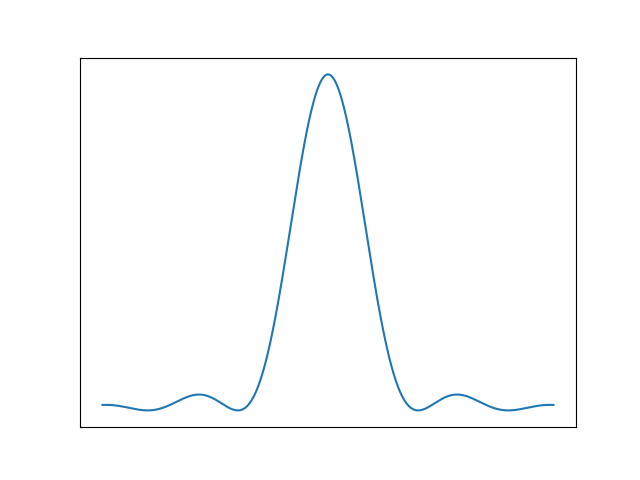
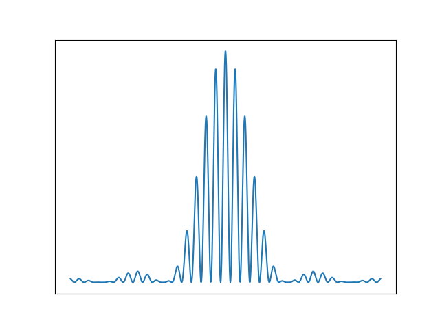
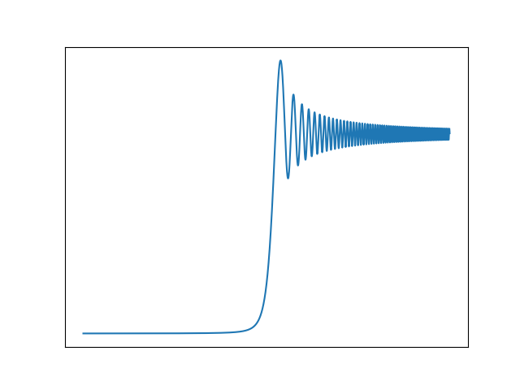

# Numerical Solution of the Wave Equation


This python program simulates the propagation of a wave through a two-dimensional medium and visualizes the results. The program supports a handful of initial wave states, barriers, and boundary conditions with a variety of parameters tunable by config file or flag.

The homogeneous wave equation is $\frac{\partial^2 u}{\partial t^2} = v^2\frac{\partial^2 u}{\partial \vec{x}^2}$, where $u$ is some solution and $v$ is the velocity of the wave.

We take a finite-difference approach to solving the wave equation in two-dimensions. 
Taking second-order centered-difference for both the temporal and spatial derivatives gives the wave equation in the form

```math
 \frac{u^{(n+1)}_{i,j} - 2u^{(n)}_{i,j} + u^{(n-1)}_{i,j}}{\left(\Delta t\right)^2} = v^2\frac{u^{(n)}_{i+1,j} + u^{(n)}_{i,j+1} - 4u^{(n)}_{i,j} + u^{(n)}_{i-1,j} + u^{(n)}_{i,j-1}}{\left(\Delta x\right)^2}
```

where the superscript $n$ denotes the time step and the subscripts $i,j$ denote the spatial location on the grid. 
At each point $(i,j)$, we solve the discretized wave equation for the value of the solution function $u$ at that point for the next time step $u_{i,j}^{(n+1)}$ via
```math
 u^{(n+1)}_{i,j} = 2u^{(n)}_{i,j} - u^{(n-1)}_{i,j} + \left(\frac{v \Delta t}{\Delta x}\right)^2\left[
u^{(n)}_{i+1,j} + u^{(n)}_{i,j+1} - 4u^{(n)}_{i,j} + u^{(n)}_{i-1,j} + u^{(n)}_{i,j-1}
\right].
```

## Features

This project includes
- Neumann, Dirichlet, and absorbing boundary conditions for the simulation box
- N-slit, corner, and circular barriers for diffraction and scattering
- Animation of the simulation
- Extraction of time-averaged diffraction patterns

## Dependencies

This code suite depends on the following Python modules
- `numpy`
- `matplotlib`
- `argparse`
- `csv`
- `os`

## How to use
The program can be run from the command line with flags etc. Below is the output of the help flag.
```
usage: python3 main.py [-h] -c CONFIG [-og GIFOUT] [-op POWEROUT] [-n NSTEPS]
                       [--fps FPS] [--cmap CMAP]

This program simulates a 2D wave equation solution using the finite difference
method. The program takes in a config file (examples in the configs/ folder)
to generate the simulation.

options:
  -h, --help            show this help message and exit
  -c CONFIG, --config CONFIG
                        Config file to be used.
  -og GIFOUT, --gifout GIFOUT
                        Name of output gif file.
  -op POWEROUT, --powerout POWEROUT
                        Name of output png of time-averaged power plot.
  -n NSTEPS, --nsteps NSTEPS
                        Number of time steps to be simulated.
  --fps FPS             Frames per second of animation.
  --cmap CMAP           Colormap to be used for animation.

Created by: Keegan Finger, Max Herrmann, Sam Liechty of CU Boulder
```
The user must supply a config file (a handful of examples are given in the `configs/` folder) to run the simulation. Fiddling with these should give a good idea of the capabilities of the program. The user can also specify the number of time steps to be simulated, the frames per second of the animation, and the colormap to be used for the animation. The user can also specify the name of the output gif file and the name of the output png of the time-averaged power plot (in absence of a file name for any output, it just won't be created).

In the config file, the user can specify the following parameters:

- `nx`: number of spatial steps in the x direction

- `ny`: number of spatial steps in the y direction

- `initial`: initial wave state (can choose from `gaussian`, `droplet`, `standing`, and `standing_drop`

-`show`: whether or not to show the animation as it is being generated

-`barrier`: specify the type of barrier (can choose from `nslit`, `corner`, and `circle`)

-`xboundary`, `yboundary`: specify the type of boundary condition (can choose from `neumann`, `dirichlet`, and `absorbing`) obeyed at the edge of the simulation

A number of options are available for each of the choices of `initial` and `barrier` (in the absence of further user input there will be defaults). For `gaussian` initial states the user can specify

-`center`: the center of the gaussian packet (default is the center of the simulation box)

-`width`: the width of the gaussian packet (default is 0.1)

-`frequency`: the frequency of the gaussian packet (default is 100)

-`height`: the height of the gaussian packet (default is 2)

For `standing` initial states the user can specify

-`frequency`: the frequency of the standing wave (default is 100)

-`height`: the height of the standing wave (default is 2)

For `droplet` initial states the user can specify (noting multiple droplets can be specified)

-`centers`: the centers of the droplets in the format `x0 y0 x1 y1 ...`

-`widths`: the widths of the droplets in the format `s0 s1 ...`

-`frequenies`: the frequencies of the droplets in the format `w0 w1 ...`

-`heights`: the heights of the droplets in the format `I0 I1 ...`

For `standing_drop` initial states the user can specify

-`xcenter`: the x center of the standing wave (defaults to center)

-`ycenter`: the y center of the standing wave (defaults to center)

-`height`: the height of the standing wave (defaults to 2)

-`frequency`: the frequency of the standing wave (defaults to 100)

For `nslit` barriers the user can specify

-`nslit`: the number of slits in the barrier (defaults to 2)

-`position`: the position of the barrier (defaults to 0.7)

-`slit_dims`: the dimensions of the slits in the format `width depth` (defaults to `0.1 0.02`)

For `corner` barriers the user can specify

-`position`: the position of the barrier (defaults to 0.7)

-`corner_width`: the width of the corner (defaults to 0.1)

For `circle` barriers the user can specify multiple circles

-`barrier_centers`: the centers of the circles in the format `x0 y0 x1 y1 ...`

-`barrier_radii`: the radii of the circles in the format `r0 r1 ...`

Finally for `absorbing` boundary conditions the user can specify a coefficient `r` related to how the walls absorb (defaults to 2)

## Stability and Error Analysis

The numerical stability of the numerical scheme presented here is most quickly evaluated through an examination of the Courant-Friedrichs-Lewy (CFL) condition. 
The CFL condition for the wave equation is the term in parentheses in the above equation, $\frac{v \Delta t}{\Delta x}$, which must be less than one for this formulation of the discrete wave equation. 
Satisfying the CFL condition is equivalent to imposing the constraint that the wave cannot move more than a single spatial step in one time step, which is necessary for maintaining numerical stability and correctly tracking the evolution of the wave through time.

The error in the numerical solution compared to the exact solution, also known as the truncation error, can be derived from Taylor series of the wave solution $u$ around a given point. 
Consider the Taylor series expansions of $u(x_0 + \Delta x,y)$:

```math
u(x_0+\Delta x,y) = u(x_0,y) + \left(\Delta x\right)u_x(x_0,y) + \frac{\left(\Delta x\right)^2}{2!}u_{xx}(x_0,y)

 + \frac{\left(\Delta x\right)^3}{3!}u_{xxx}(x_0,y) + \frac{\left(\Delta x\right)^4}{4!}u_{xxxx}(x_0,y) +\cdots, 
```
and $u(x_0 - \Delta x,y)$:
```math
 u(x_0-\Delta x,y) = u(x_0,y) - \left(\Delta x\right)u_x(x_0,y) + \frac{\left(\Delta x\right)^2}{2!}u_{xx}(x_0,y) 

 - \frac{\left(\Delta x\right)^3}{3!}u_{xxx}(x_0,y) + \frac{\left(\Delta x\right)^4}{4!}u_{xxxx}(x_0,y) + \cdots 
```
To get the second-order centered difference that we use, consider:
```math
\begin{align}
 u(x_0+\Delta x,y) + u(x_0-\Delta x,y) &= 2u(x_0,y) + \left(\Delta x\right)^2u_{xx}(x_0,y)\\
 &+ \frac{2\left(\Delta x\right)^4}{4!}u_{xxxx}(x_0,y) + \cdots \\
 \Rightarrow u_{xx}(x_0,y) &= \frac{u(x_0+\Delta x,y) + u(x_0-\Delta x,y)- 2u(x_0,y)}{\left(\Delta x\right)^2} + \mathcal{O}\left(\Delta x^2\right) 
\end{align}
```
For our case, in two-dimensions,
```math
\begin{align}
     \Delta_h u - \Delta u &= u^{(h)}_{xx} + u^{(h)}_{yy} - u_{xx} - u_{yy}\\
     &= u_{xx} + \mathcal{O}\left(\Delta x^2\right) + u_{yy} + \mathcal{O}\left(\Delta x^2\right) - u_{xx} - u_{yy}\\
     &= \mathcal{O}\left(\Delta x^2\right)\\
     \partial_{t}^{(h)2} u - \partial_{t}^2 u &= u^{(h)}_{tt}- u_{tt} = u_{tt} + \mathcal{O}\left(\Delta t^2\right) - u_{tt} = \mathcal{O}\left(\Delta t^2\right)\\
    \delta u &= \mathcal{O}\left(\Delta x^2\right) + \mathcal{O}\left(\Delta t^2\right)
\end{align}
```

## Validation
We validated our simulation by comparing time-averaged diffraction patterns from our simulation to those from analytical solutions for single-slit diffraction, double-slit diffraction, and corner diffraction. Below are the plots of 'intensity' vs position on the far wall compared to the analytical solutions (purely for qualitative elements). Note that outside the center of the central maxima for n-slit diffraction the results are less satisfactory due to reflections from the boundary of the simulation.

Scenario    |   Theory       |  Simulation
------------|----------------|----------------
Single-slit |    |  
Double-slit |    |  
Edge    |         |  
